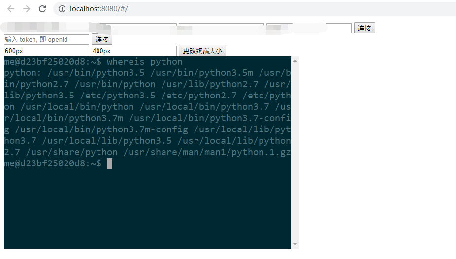

# aio-webssh

一个基于 vue，xtermjs，aiohttp，paramiko 的 web 终端

后端可选 tornado 或 aiohttp

server.py 是基于 tornado 的, app.py 是基于 aiohttp

# 安装

- pip install -r requirement.txt

# 启动

- python app.py
- cd webssh
- npm install && npm run dev
- 访问: http://localhost:8080/#/

# 效果图

